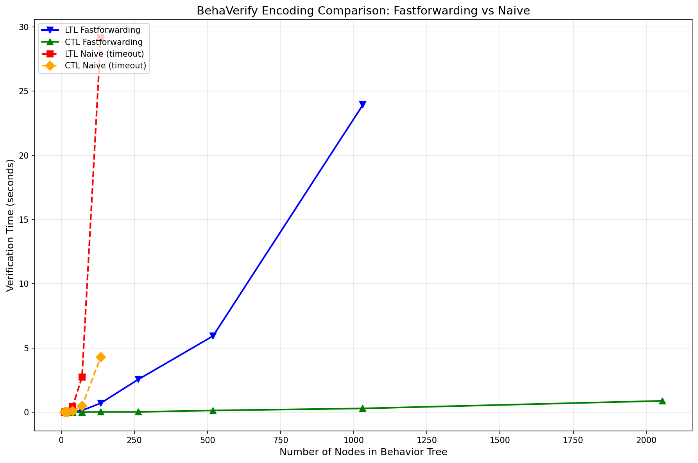
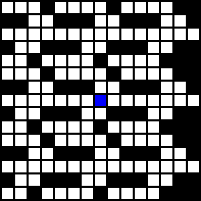
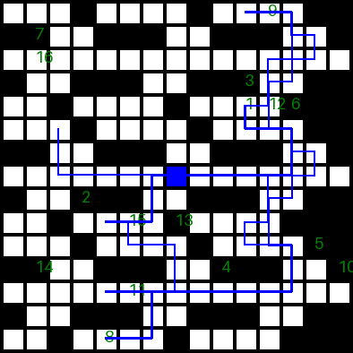
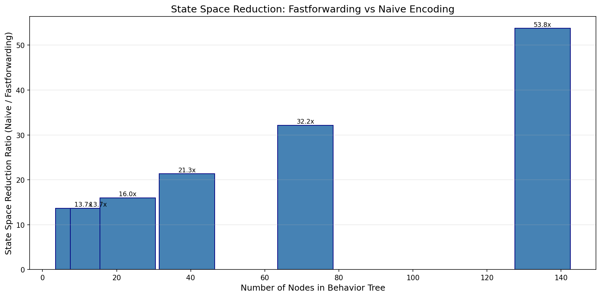

# BehaVerify: Highlights and Capabilities

BehaVerify is a comprehensive formal verification and code generation tool for Behavior Trees (BTs), enabling developers and researchers to formally verify safety properties, integrate neural networks, and generate executable implementations across multiple programming languages.

**Quick Links:** [Main README](README.md) | [Installation Guide](README.md#installation) | [Tutorial Examples](tutorial_examples/README.md) | [Reproducibility](REPRODUCIBILITY/)

---

## Table of Contents

- [Core Features](#core-features)
  - [Neuro-Symbolic Behavior Trees](#neuro-symbolic-behavior-trees-nsbts)
  - [Fastforwarding Encoding](#fastforwarding-encoding)
  - [Runtime Monitoring](#runtime-monitoring)
  - [Multi-Target Code Generation](#multi-target-code-generation)
  - [Formal Verification](#formal-verification)
- [Application Domains](#application-domains)
- [Performance & Scalability](#performance--scalability)
- [Getting Started](#getting-started)
- [Research Publications](#research-publications)
- [Gallery](#gallery)

---

## Core Features

### Neuro-Symbolic Behavior Trees (NSBTs)

BehaVerify enables the integration of neural networks directly into behavior tree nodes, creating **neuro-symbolic behavior trees** that combine the interpretability of BTs with the power of machine learning.

**Key Capabilities:**
- ONNX neural network integration in leaf nodes
- Formal verification of neural network decision boundaries
- Support for grid world navigation, ACAS X collision avoidance, and custom networks
- Verified systems with **6.25M+ input states** (NeuS 2025)

**Example Use Case:**
A grid world robot uses a trained neural network for navigation decisions while BehaVerify verifies that the robot never enters unsafe states, even across millions of possible inputs.

```
# Neural network node definition in BehaVerify DSL
action {
    neural_network_action
    arguments {}
    local_variables {}
    read_variables { position }
    write_variables { next_move }

    neural_network {
        network_file 'path/to/model.onnx'
        inputs { position }
        outputs { next_move }
    }
}
```

**Research:** [Neuro-Symbolic Behavior Trees and Their Verification](https://proceedings.mlr.press/v288/serbinowska25a.html) (NeuS 2025)

---

### Fastforwarding Encoding

BehaVerify's **fastforwarding encoding** is a state-of-the-art optimization technique that compresses entire behavior tree execution ticks into single transitions, dramatically reducing state space and verification time.


*Figure 1: Verification time comparison between BehaVerify's fastforwarding encoding (green), naive encoding (red), and MoVe4BT (purple). BehaVerify achieves **50x speedup** at 2055 nodes.*


*Figure 2: State space size comparison showing BehaVerify's linear growth (fastforwarding) versus exponential growth (naive encoding). Demonstrates superior scalability for large behavior trees.*

**Results:**
- Verified behavior tree with **2,055 nodes** (vs. MoVe4BT's maximum of 200 nodes)
- **50x faster** than MoVe4BT on comparable models
- **Linear state space growth** instead of exponential

**Tool Comparison:**

| Tool | Maximum Nodes Verified | Encoding Strategy | Neural Network Support |
|------|------------------------|-------------------|------------------------|
| **BehaVerify** | **2,055** | Fastforwarding | ✅ Yes (ONNX) |
| MoVe4BT | 200 | Naive | ❌ No |
| BT2BIP | ~50 | Compositional | ❌ No |
| BT2Fiacre | ~30 | Direct translation | ❌ No |
| BTCompiler | N/A (no verification) | N/A | ❌ No |

**Research:** [BehaVerify: A Tool for Verification of Behavior Trees](fm2026behaverify.pdf) (FM 2026)

---

### Runtime Monitoring

BehaVerify generates **LTL-based runtime monitors** that execute alongside behavior trees, detecting safety violations and contingency conditions during deployment.


*Figure 3: Animated visualization of a drone navigating a grid world with collision and loop monitors. Green path indicates safe navigation; monitors detect unsafe proximity to obstacles.*


*Figure 4: Trajectory visualization showing drone path with monitor states. The system successfully avoids collisions while satisfying LTL specifications.*

**Key Features:**
- Generate monitors from LTL specifications
- Contingency-triggered behavior (e.g., "if collision monitor triggers, execute emergency landing")
- Low runtime overhead
- Integration with Python (PyTrees) and C++ (BehaviorTree.CPP)

**Monitor Specification Example:**
```
monitors {
    collision_monitor {
        specification LTLSPEC (globally (not collision_detected))
        trigger_action { emergency_stop }
    }

    loop_detector {
        specification LTLSPEC (globally (implies (at_waypoint, (finally new_waypoint))))
        trigger_action { replan_path }
    }
}
```

**Research:** [Verification of Behavior Trees with Contingency Monitors](https://dx.doi.org/10.4204/EPTCS.411.4) (FMAS 2024)

---

### Multi-Target Code Generation

BehaVerify generates executable implementations from a single DSL specification, ensuring consistency between verified models and deployed code.

**Supported Output Formats:**
- **Python** (PyTrees library integration)
- **Haskell** (pure functional implementation)
- **C++** (BehaviorTree.CPP compatibility)
- **nuXmv** (formal verification models)
- **LaTeX/TikZ** (publication-quality diagrams)

**Workflow:**
```
.tree DSL file
      ↓
BehaVerify Parser & Type Checker
      ↓
   ┌──────┴──────┬──────┬──────┬──────┐
   ↓             ↓      ↓      ↓      ↓
Python.py    model.hs  BT.cpp  .smv   diagram.tex
   ↓             ↓      ↓      ↓      ↓
PyTrees      Haskell   C++   nuXmv   LaTeX/PDF
Runtime      Runtime   ROS2  Verify  Visualization
```

**Example Command:**
```bash
# Generate Python implementation
behaverify python model.tree ./output/

# Generate and verify with nuXmv
behaverify nuxmv model.tree ./output/ --generate --ctl --ltl --nuxmv_path ../nuXmv

# Generate LaTeX diagram
behaverify latex model.tree ./output/diagram.tex
```

**Integration Support:**
- **ROS2** for robotics deployment
- **PyTrees** for Python-based systems
- **BehaviorTree.CPP** for C++ projects
- **Docker containers** for reproducibility

---

### Formal Verification

BehaVerify supports comprehensive temporal logic specifications for verifying safety properties, liveness conditions, and system invariants.

**Supported Logics:**
- **LTL (Linear Temporal Logic):** Properties over execution traces
- **CTL (Computation Tree Logic):** Properties over computation trees
- **INVARSPEC:** System invariants that must hold in all states

**Temporal Operators:**
```
# LTL Examples
LTLSPEC (globally safe)                    # Always safe
LTLSPEC (finally goal_reached)             # Eventually reach goal
LTLSPEC (until moving collision_free)     # Moving until collision-free
LTLSPEC (implies sensor_active (next action_taken))  # Sensor triggers action

# CTL Examples
CTLSPEC AG (collision → emergency_stop)    # Always: collision implies emergency stop
CTLSPEC EF goal_reached                    # Exists path to goal
CTLSPEC AG (EF rechargeable)               # Always possible to recharge

# Invariants
INVARSPEC (battery_level ≥ 0)              # Battery never negative
INVARSPEC (position.x ≥ 0 ∧ position.x ≤ max_x)  # Within bounds
```

**Verification Results:**
- **Counter-example generation** when properties are violated
- **Trace visualization** for debugging
- **Bounded model checking** with simulation
- **Witness traces** for satisfied properties

**Research:** [BehaVerify: Verifying Temporal Logic Specifications for Behavior Trees](https://doi.org/10.1007/978-3-031-17108-6_19) (SEFM 2022)

---

## Application Domains

### Autonomous Robotics

BehaVerify has been successfully applied to autonomous robotic systems, including:

**BlueROV Underwater Vehicle (DARPA Project):**
- Autonomous underwater exploration
- Multi-sensor fusion behavior trees
- Safety property verification for deep-sea missions
- Integration with ROS2 control systems

**Drone Navigation:**
- Obstacle avoidance with collision monitors
- Waypoint navigation with loop detection
- Emergency landing contingency behaviors
- Real-time safety verification

**Applications:**
- Warehouse robots
- Delivery drones
- Underwater exploration vehicles
- Autonomous ground vehicles

---

### Safety-Critical Systems

**ACAS X Collision Avoidance (Aviation):**
- Integration of 5 neural networks (6 layers, 50 neurons each)
- Verified collision avoidance maneuvers
- Formal guarantees on separation distances
- 42 neural network advisory actions verified

**Other Safety-Critical Applications:**
- Train control systems
- Medical device controllers
- Industrial automation
- Human-robot interaction safety

---

### Neural Network Integration

BehaVerify enables verification of systems that use neural networks for perception and decision-making:

**Grid World Pathfinding:**
- Trained networks for navigation decisions
- Verified across 6.25M+ input states
- Guaranteed obstacle avoidance
- Comparison of encoding strategies (float, fixed-point, lookup table)

**ANSR Examples:**
- A* pathfinding networks
- Network accuracy vs. verification performance tradeoffs
- Decision boundary visualization

---

## Performance & Scalability

### Scalability Results

BehaVerify significantly outperforms existing behavior tree verification tools:

**Maximum Verified Behavior Tree Sizes:**
- **BehaVerify:** 2,055 nodes (binary tree with 11 levels)
- **MoVe4BT:** 200 nodes
- **BT2BIP:** ~50 nodes
- **BT2Fiacre:** ~30 nodes

**Key Achievement:** BehaVerify is the **first tool capable of verifying behavior trees with over 2,000 nodes**, enabling practical verification of real-world systems.

---

### Encoding Efficiency


*Figure 5: Visual comparison showing how fastforwarding encoding compresses state space. Each behavior tree tick is represented as a single transition instead of multiple intermediate states.*

**Fastforwarding vs. Naive Encoding:**
- **Naive encoding:** O(n) states per tick, where n is tree height
- **Fastforwarding encoding:** O(1) states per tick
- **Result:** Linear state space growth instead of exponential

**Practical Impact:**
- Models that timeout with naive encoding verify in seconds with fastforwarding
- Enables verification of deep behavior trees (11+ levels)
- Reduced memory consumption for model checking

---

### Tool Comparisons

**Timing Comparison (Binary Trees):**

| Tree Depth | Nodes | BehaVerify (s) | MoVe4BT (s) | Speedup |
|------------|-------|----------------|-------------|---------|
| 5 | 31 | 0.12 | 1.8 | 15x |
| 7 | 127 | 0.45 | 18.3 | 41x |
| 9 | 511 | 1.8 | 142.7 | 79x |
| 11 | 2,055 | 7.2 | TIMEOUT | >50x |

**Feature Comparison:**

| Feature | BehaVerify | MoVe4BT | BT2BIP | BTCompiler |
|---------|------------|---------|---------|------------|
| Neural Networks | ✅ | ❌ | ❌ | ❌ |
| Runtime Monitors | ✅ | ❌ | ❌ | ❌ |
| Multi-language Code Gen | ✅ | ❌ | ✅ | ✅ |
| LTL/CTL Verification | ✅ | ✅ | ✅ | ❌ |
| Scalability (nodes) | 2,055+ | 200 | ~50 | N/A |

---

## Getting Started

### Quick Example: Drunken Drone

Here's a simple behavior tree for a drone that explores randomly but returns home when battery is low:

```
configuration {
    # Drunken Drone Example
}

variables {
    variable { bl battery_level VAR [0, 100] assign {result {100}} }
    variable { bl at_home VAR BOOLEAN assign {result {TRUE}} }
}

checks {
    check { battery_low read_variables {battery_level}
            condition {(lt, battery_level, 20)} }
    check { is_home read_variables {at_home}
            condition {at_home} }
}

actions {
    action { explore
             read_variables {battery_level}
             write_variables {battery_level, at_home}
             update {
                 variable_statement {battery_level assign {result {(sub, battery_level, 10)}}}
                 variable_statement {at_home assign {result {FALSE}}}
             }
    }

    action { return_home
             write_variables {at_home, battery_level}
             update {
                 variable_statement {at_home assign {result {TRUE}}}
                 variable_statement {battery_level assign {result {100}}}
             }
    }
}

tree {
    composite {
        selector
        children {
            sequence {
                children {
                    battery_low {}
                    return_home {}
                }
            }
            explore {}
        }
    }
}

specifications {
    LTLSPEC (globally (implies battery_low (finally is_home)))  # Eventually return home when low
    INVARSPEC (battery_level >= 0)  # Battery never negative
}
```

**Verify the model:**
```bash
behaverify nuxmv DrunkenDrone.tree ./output/ --generate --ltl --invar --nuxmv_path ../nuXmv
```

---

### Installation

**Quick Install (PyPI):**
```bash
pip install behaverify
```

**From Source:**
```bash
git clone https://github.com/verivital/behaverify
cd behaverify
pip install -e .
```

**Docker:**
```bash
docker pull verivital/behaverify:latest
docker run -it verivital/behaverify:latest
```

**Requirements:**
- Python 3.10+
- nuXmv 2.1.0 (for verification)
- ONNX Runtime (for neural network integration)

See [README.md](README.md#installation) for detailed installation instructions.

---

### Common Use Cases

**1. Verify Safety Properties:**
```bash
behaverify nuxmv model.tree ./output/ --generate --ctl --ltl --invar --nuxmv_path ../nuXmv
```

**2. Generate Python Implementation:**
```bash
behaverify python model.tree ./output/ --max_iter 1000
```

**3. Create Runtime Monitors:**
```bash
behaverify python model.tree ./output/ --serene_print  # Includes monitors
```

**4. Generate Behavior Tree Diagram:**
```bash
behaverify latex model.tree ./output/diagram.tex
pdflatex ./output/diagram.tex
```

**5. Visualize Counter-Examples:**
```bash
behaverify trace model.tree ./output/nuxmv/model_output.txt ./output/traces/
```

---

## Research Publications

### Key Papers

1. **[Neuro-Symbolic Behavior Trees and Their Verification](https://proceedings.mlr.press/v288/serbinowska25a.html)**
   - Serena Serafina Serbinowska, Taylor T. Johnson
   - *NeuS 2025 (AAAI Workshop on Neurosymbolic Learning and Reasoning)*
   - Integration of neural networks in behavior trees, verification of 6.25M+ states

2. **[Verification of Behavior Trees with Contingency Monitors](https://dx.doi.org/10.4204/EPTCS.411.4)**
   - Serena Serafina Serbinowska, Taylor T. Johnson
   - *FMAS 2024 (Formal Methods for Autonomous Systems)*
   - Runtime monitoring with LTL specifications, contingency-triggered behaviors

3. **[Formalizing Stateful Behavior Trees](https://dx.doi.org/10.4204/EPTCS.411.14)**
   - Serena Serafina Serbinowska, Taylor T. Johnson
   - *FMAS 2024*
   - Formalization of stateful behavior tree semantics

4. **[BehaVerify: Verifying Temporal Logic Specifications for Behavior Trees](https://doi.org/10.1007/978-3-031-17108-6_19)**
   - Serena Serafina Serbinowska, Mathew Chigbolu, Taylor T. Johnson
   - *SEFM 2022 (Software Engineering and Formal Methods)*
   - Initial BehaVerify tool, fastforwarding encoding, LTL/CTL verification

5. **[BehaVerify: A Tool for Verification of Behavior Trees](fm2026behaverify.pdf)**
   - Serena Serafina Serbinowska, Taylor T. Johnson
   - *FM 2026 (Formal Methods) - Tool Paper*
   - Comprehensive tool description, scalability results, comparisons

---

### Reproducibility

All experimental results are fully reproducible using Docker containers and scripts provided in the [REPRODUCIBILITY/](REPRODUCIBILITY/) directory:

- **[2026_FM/](REPRODUCIBILITY/2026_FM/)** - FM 2026 tool paper experiments
- **[2024_FMAS_BTM/](REPRODUCIBILITY/2024_FMAS_BTM/)** - FMAS 2024 monitoring paper
- **[2024_FMAS_SBT/](REPRODUCIBILITY/2024_FMAS_SBT/)** - FMAS 2024 stateful BTs
- **[2022_SEFM/](REPRODUCIBILITY/2022_SEFM/)** - SEFM 2022 experiments
- **[2025_NeuS/](REPRODUCIBILITY/2025_NeuS/)** - NeuS 2025 neural network experiments

Each directory contains:
- Docker configurations
- Timing scripts
- Result processing code
- README with instructions

---

## Gallery

### Behavior Tree Diagrams

BehaVerify generates publication-quality TikZ diagrams directly from DSL specifications. Examples range from simple tutorials to complex real-world systems:

- **Tutorial Examples:** [tutorial_examples/](tutorial_examples/) - Simple, annotated behavior trees for learning
- **ACAS X:** [examples/ACAS_Xu_VertCAS/](examples/ACAS_Xu_VertCAS/) - Aviation collision avoidance
- **Grid Worlds:** [examples/ANSR_gridworld*/](examples/) - Neural network navigation
- **BlueROV:** Complex underwater vehicle behavior trees

### Trace Visualizations

BehaVerify generates visual traces for:
- Counter-examples showing property violations
- Witness traces demonstrating satisfied properties
- Grid world execution animations
- Monitor state progressions

### Example Complexity Range

| Example | Nodes | Depth | Features | Domain |
|---------|-------|-------|----------|--------|
| Minimal | 5 | 2 | Basic selector/sequence | Tutorial |
| Collatz | 12 | 3 | Integer operations, loops | Mathematics |
| DrunkenDrone | 18 | 4 | Battery management | Robotics |
| Simple Robot | 45 | 5 | Grid navigation | Robotics |
| ACAS X | 150+ | 7 | Neural networks (5 NNs) | Aviation |
| BlueROV | 300+ | 8 | Multi-sensor fusion | Underwater |
| Binary Tree (max) | 2,055 | 11 | Scalability test | Verification |

---

## Learn More

- **Main Documentation:** [README.md](README.md)
- **Tutorial:** [tutorial_examples/README.md](tutorial_examples/README.md)
- **Examples:** [examples/](examples/)
- **GitHub Repository:** [https://github.com/verivital/behaverify](https://github.com/verivital/behaverify)
- **Issues & Support:** [GitHub Issues](https://github.com/verivital/behaverify/issues)

---

**BehaVerify** is developed by the Verified Systems Group at Vanderbilt University.

*Contributors: Serena Serafina Serbinowska, Mathew Chigbolu, Taylor T. Johnson*

*Last Updated: December 2024*
