# BehaVerify FMAS 2024: Behavior Tree Monitoring (BTM) Reproducibility

This README provides instructions for reproducing results from the FMAS 2024 paper:

**"Verification of Behavior Trees with Contingency Monitors"**
- arXiv: https://arxiv.org/abs/2411.14162
- Authors: Serena S. Serbinowska, Nicholas Potteiger, Anne M. Tumlin, Taylor T. Johnson
- Conference: FMAS 2024 (Formal Methods for Autonomous Systems)

---

## Table of Contents

1. [Introduction](#introduction)
2. [BTM Framework Overview](#btm-framework-overview)
3. [Visual Examples](#visual-examples)
4. [Prerequisites](#prerequisites)
5. [Quick Start with Docker](#quick-start-with-docker)
6. [Running Locally](#running-locally-without-docker)
7. [Tutorial: Using BTM with Your Own Models](#tutorial-using-btm-with-your-own-models)
8. [Experiments Explained](#experiments-explained)
9. [Understanding the Results](#understanding-the-results)
10. [Directory Structure](#directory-structure)
11. [Troubleshooting](#troubleshooting)
12. [Future Work: CLI Integration](#future-work-cli-integration)
13. [Citation](#citation)
14. [Related Papers](#related-papers)

---

## Introduction

### What is BTM?

**Behavior Tree Monitoring (BTM)** is a runtime verification approach that enables autonomous systems to detect and respond to violations of safety specifications during execution. Unlike traditional design-time verification (which checks properties before deployment), BTM provides **continuous runtime assurance** by monitoring LTL (Linear Temporal Logic) specifications as the system operates.

Key advantages of BTM:
- **Runtime detection** of specification violations
- **Corrective action** when unsafe behavior is detected
- **Modular monitors** that can be swapped without changing the behavior tree
- **Comparable performance** to existing runtime verification tools

### About This Artifact

This artifact demonstrates BehaVerify's runtime monitor generation capabilities and compares them against:

- **BehaVerify (Python/C)** - LTL-based monitor synthesis from behavior tree models
- **Copilot (Haskell)** - Time-triggered runtime verification framework
- **Monitorless baseline** - Behavior tree execution without monitoring overhead
- **Design-time verification (nuXmv)** - Formal verification for comparison

The experiments use **drone navigation** scenarios in grid worlds with collision avoidance and loop detection monitors.

### Paper Contributions

1. **LTL Monitor Synthesis**: Automatic generation of executable monitors from LTL specifications in .tree files
2. **Runtime Performance**: BehaVerify monitors match the performance of existing tools (Copilot)
3. **Modularity**: Monitors can be easily modified or replaced with minimal effort
4. **Dual Verification**: Combines design-time verification (nuXmv) with runtime monitoring

---

## BTM Framework Overview

### Monitor Types

The experiments demonstrate two LTL monitors integrated into drone navigation behavior trees:

#### 1. Collision Monitor

**Purpose:** Ensures the drone never collides with obstacles

**LTL Specification (simplified):**
```
G(¬collision_with_any_obstacle)
```

**BehaVerify DSL Format:**
```
monitor {
    collision_monitor
    (safe : 'safe')
    (unsafe : 'unsafe')
    (unknown : 'unknown')
    LTLSPEC {
        (globally,
            (not,
                collision_detected_at_next_position
            )
        )
    }
}
```

The monitor checks whether the drone's next position (accounting for speed and direction) would intersect with any obstacle. If a collision is imminent, the monitor enters the `unsafe` state, triggering corrective action (reducing speed).

#### 2. Loop Monitor

**Purpose:** Prevents oscillating back-and-forth movement (e.g., left-right-left-right)

**LTL Specification:**
```
G((left → X(¬right)) ∧ (right → X(¬left)) ∧ (up → X(¬down)) ∧ (down → X(¬up)))
```

**BehaVerify DSL Format:**
```
monitor {
    loop_monitor
    (safe : 'safe')
    (unsafe : 'unsafe')
    (unknown : 'unknown')
    LTLSPEC {
        (globally,
            (and,
                (implies, (eq, current_action, 'left'), (next, (neq, current_action, 'right'))),
                (implies, (eq, current_action, 'right'), (next, (neq, current_action, 'left'))),
                (implies, (eq, current_action, 'up'), (next, (neq, current_action, 'down'))),
                (implies, (eq, current_action, 'down'), (next, (neq, current_action, 'up')))
            )
        )
    }
}
```

The monitor detects when the drone would reverse direction immediately (e.g., moving left after just moving right), indicating inefficient or stuck behavior.

### Monitor States

Each monitor operates as a finite state machine with three states:

- **`safe`** - Specification is currently satisfied (normal operation)
- **`unsafe`** - Specification has been violated (corrective action triggered)
- **`unknown`** - Initial state or indeterminate (before sufficient trace information)

**Corrective Actions:**
- **Collision Monitor** → Reduce drone speed to 1 (from 2) when unsafe
- **Loop Monitor** → Reset monitor state, reduce speed to 1, allowing escape from local minimum

### How Monitors Work

The BTM workflow converts LTL specifications into executable code:

```
┌─────────────────┐
│  .tree file     │
│  with monitors  │
│  block          │
└────────┬────────┘
         │
         ▼
┌─────────────────────────────┐
│ create_dsl_monitor.py       │
│ Extract LTL specifications  │
│ Output: monitor_name.txt    │
└────────┬────────────────────┘
         │
         ▼
┌─────────────────────────┐
│ LTL2BA (external tool)  │
│ Convert LTL → Buchi     │
│ automaton               │
│ Output: monitor_name.ba │
└────────┬────────────────┘
         │
         ▼
┌──────────────────────────────┐
│ create_python_monitor.py or  │
│ create_c_monitor.py          │
│ Generate executable monitor  │
│ Output: monitor_name.py/.c   │
└────────┬─────────────────────┘
         │
         ▼
┌────────────────────────┐
│ Integrated into        │
│ Behavior Tree          │
│ execution (main.py/c)  │
└────────────────────────┘
```

**Key Steps:**
1. **Specification** - Define monitors in .tree file using LTL operators
2. **Extraction** - Parse LTL formulas and convert to LTL2BA input format
3. **Synthesis** - Generate Buchi automaton representing the specification
4. **Code Generation** - Convert automaton to executable Python or C code
5. **Integration** - Call monitor transition functions during BT execution

### Comparison Frameworks

| Framework | Language | Monitor Approach | Integration |
|-----------|----------|-----------------|-------------|
| **BehaVerify (Python)** | Python | LTL → BA → Python FSM | Inline in BT nodes |
| **BehaVerify (C)** | C | LTL → BA → C FSM | Inline in BT nodes |
| **Copilot** | Haskell | Time-triggered monitors | Separate monitoring process |
| **Monitorless** | Python/C | No monitoring | N/A (baseline) |
| **Design-time (nuXmv)** | SMV | LTL model checking | Pre-deployment only |

**Performance Comparison:**
- BehaVerify and Copilot have **comparable runtime overhead**
- Monitor **file sizes** (automata complexity) vary by specification
- Design-time verification can be **more expensive** than runtime monitoring for large state spaces

---

## Visual Examples

### Featured Monitor Executions

Below are three highlighted examples demonstrating BTM across different scales and obstacle densities:

#### Medium Grid (24x24) - Dense Obstacles - BehaVerify

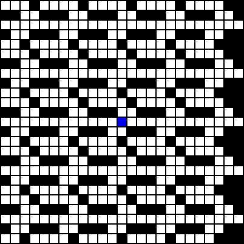

**Description:** Drone navigates a 24x24 grid with 200 densely-packed obstacles (8×8 cells each). BehaVerify collision and loop monitors detect potential violations and trigger corrective actions (speed reduction) to ensure safe navigation.

#### Large Grid (34x34) - Sparse Obstacles - Copilot

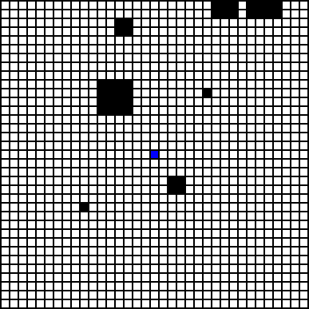

**Description:** Drone navigates a 34x34 grid with 10 sparsely-distributed obstacles. Copilot framework provides comparable monitoring with a time-triggered approach, showing that different monitor implementations can achieve similar safety guarantees.

#### Largest Grid (49x49) - Dense Obstacles - Copilot

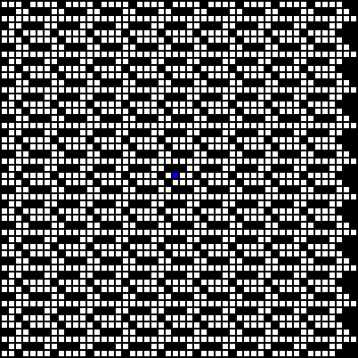

**Description:** Largest experimental scenario with 49x49 grid and 800 densely-packed obstacles. Demonstrates scalability of runtime monitoring to complex environments with extensive state spaces.

### Gallery: Additional Examples

<details>
<summary>Click to expand gallery with 13 additional examples</summary>

#### Small Scale (9x9)

| Dense Obstacles | Sparse Obstacles |
|----------------|------------------|
| 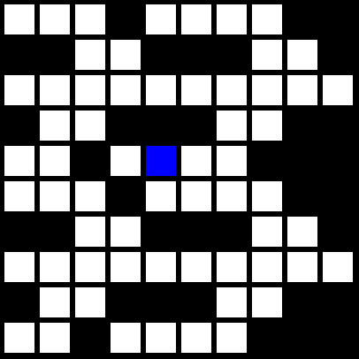 | 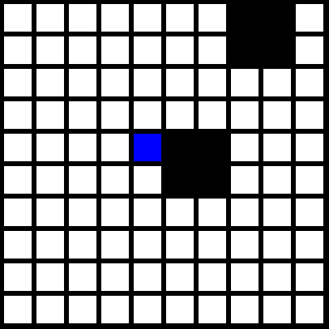 |
|  |  |

#### Medium Scale (19x19 - 29x29)

| Scenario | BehaVerify | Copilot |
|----------|-----------|---------|
| 19x19 Dense | 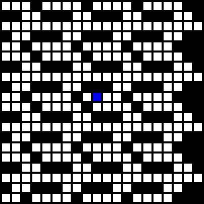 | 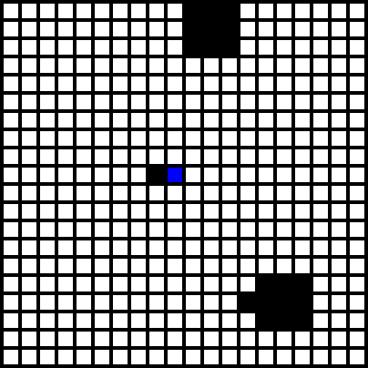 |
| 29x29 Dense | 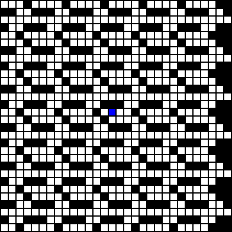 | 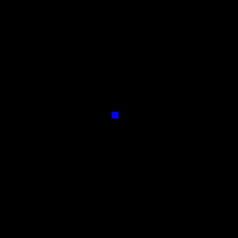 |

#### Large Scale (34x34 - 44x44)

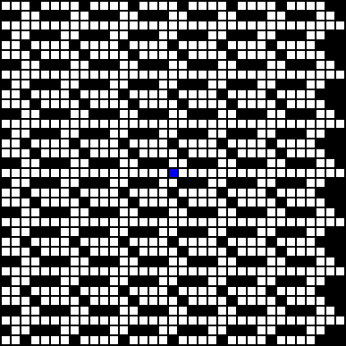
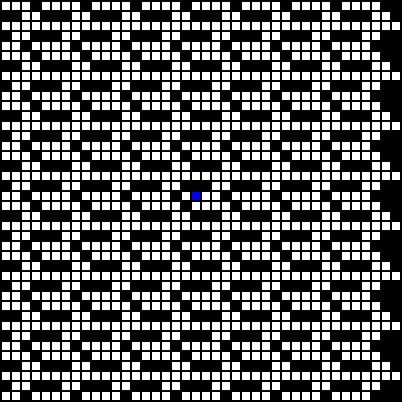
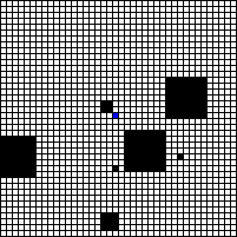
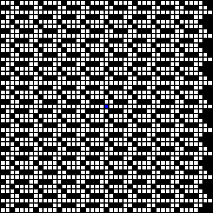


</details>

### Representative Still Frames


*Initial state of 24x24 dense grid showing obstacle layout*

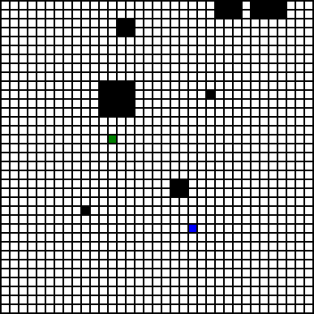
*Successful path completion in 34x34 sparse grid*

---

## Prerequisites

1. **Docker** with ability to run as regular user (see https://docs.docker.com/engine/install/linux-postinstall/)
2. **nuXmv** model checker - Download from https://nuxmv.fbk.eu/
   - Version 2.0.0 or 2.1.0 (Linux 64-bit)
   - Place the binary in this directory as `nuXmv` (no file extension)
3. **Python 3** with `docker` package: `pip install docker`

---

## Quick Start with Docker

### Install Test (~3 min)
```bash
python3 ./python_script/build_and_run.py ./ ./nuXmv install ./install
```

### Partial Test (~8 min)
```bash
python3 ./python_script/build_and_run.py ./ ./nuXmv partial ./partial
```

### Full Test (~16 min)
```bash
python3 ./python_script/build_and_run.py ./ ./nuXmv full ./full
```

Results will be in `/path/to/output.tar`. Extract and check `example/images/` for generated figures.

---

## Running Locally (without Docker)

### Installation
```bash
# Install dependencies
sudo apt update && sudo apt upgrade
sudo apt install python3 pip graphviz
pip install py_trees pandas jinja2 textX matplotlib pillow

# Clone repository
git clone https://github.com/verivital/behaverify
cd behaverify/REPRODUCIBILITY/2024_FMAS_BTM

# Enable scripts
chmod -R +x ./*.sh ./example/*.sh

# Place nuXmv binary
# Download from https://nuxmv.fbk.eu/ and place as ./nuXmv
chmod +x ./nuXmv
```

### Run Experiments
```bash
# Install test (2 iterations)
./BehaVerify_2024_FMAS_BTM.sh ./ 2

# Partial test (5 iterations)
./BehaVerify_2024_FMAS_BTM.sh ./ 5

# Full test (9 iterations)
./BehaVerify_2024_FMAS_BTM.sh ./ 9
```

Results will be in `example/images/`.

---

## Tutorial: Using BTM with Your Own Models

This tutorial walks through creating a .tree file with monitors and generating executable monitored code.

### Step 1: Define Monitors in .tree File

Add a `monitors {}` block to your .tree file after the `variables {}` section:

```
variables {
    variable { bl current_action VAR {'left', 'right', 'up', 'down', 'no_action'} assign{result{'no_action'}}}
    variable { bl drone_x VAR [0, 50] assign{result{25}}}
    variable { bl drone_y VAR [0, 50] assign{result{25}}}
    # ... other variables
} end_variables

monitors {
    monitor {
        my_safety_monitor
        (safe : 'safe')
        (unsafe : 'unsafe')
        (unknown : 'unknown')
        LTLSPEC {
            (globally, your_ltl_specification_here)
        }
    }
}
```

**LTL Operators Available:**
- Temporal: `globally`, `finally`, `next`, `until`, `release`
- Boolean: `and`, `or`, `not`, `implies`, `equivalent`
- Comparison: `eq`, `neq`, `lt`, `lte`, `gt`, `gte`
- Arithmetic: `add`, `sub`, `mult`, `idiv`, `mod`

### Step 2: Generate LTL Commands

Use `create_dsl_monitor.py` to extract LTL specifications:

```bash
python3 ../../../src/behaverify/monitor/create_dsl_monitor.py make_ltl2ba \
    ../../../src/behaverify/data/metamodel/behaverify.tx \
    your_model.tree \
    ./output_directory/ \
    --recursion_limit 10000 \
    --no_checks
```

**Output:** Creates `monitor_name.txt` files with LTL formulas in LTL2BA format.

### Step 3: Convert to Buchi Automata

Use LTL2BA to convert LTL formulas to Buchi automata:

```bash
# Read the LTL command
ltl_command=$(cat ./output_directory/monitor_name.txt)

# Generate Buchi automaton (requires LTL2BA tool)
ltl2ba -f "$ltl_command" > ./output_directory/monitor_name.ba
```

**Note:** LTL2BA is an external tool. See https://www.lsv.fr/~gastin/ltl2ba/ for download.

### Step 4: Generate Monitor Code

Convert the Buchi automaton to executable Python or C code:

**For Python:**
```bash
python3 ../../../src/behaverify/monitor/create_python_monitor.py ba_to_monitor \
    ./output_directory/monitor_name.ba \
    ./output_directory/monitor_name.py
```

**For C:**
```bash
python3 ../../../src/behaverify/monitor/create_c_monitor.py ba_to_monitor \
    ./output_directory/monitor_name.ba \
    ./output_directory/monitor_name.c
```

**Output:** Generates `monitor_name.py` or `monitor_name.c` with `transition()` and `reset()` functions.

### Step 5: Integrate with Behavior Tree

Import and call the generated monitor in your behavior tree execution code:

**Python Example:**
```python
from monitor_name import transition as monitor_transition, reset as monitor_reset

# Initialize monitor
MONITOR_STATE = monitor_reset()

# During execution loop
(MONITOR_STATE, monitor_status) = monitor_transition(
    MONITOR_STATE,
    {
        'variable_name': variable_value,
        'another_var': another_value
    }
)

# Check monitor status
if monitor_status == 'unsafe':
    # Take corrective action
    speed = 1  # Reduce speed
elif monitor_status == 'safe':
    # Normal operation
    pass
```

**C Example:**
```c
#include "monitor_name.h"

// Initialize monitor
MonitorState monitor_state = monitor_reset();

// During execution loop
MonitorResult result = monitor_transition(
    &monitor_state,
    drone_x, drone_y, current_action
);

// Check monitor status
if (strcmp(result.status, "unsafe") == 0) {
    // Take corrective action
    speed = 1;
}
```

### Complete Example Workflow

See `example/pipeline_existing_behaverify_python.sh` for a complete end-to-end example:

1. Generate Python behavior tree code from .tree file
2. Extract LTL specifications to .txt files
3. Convert LTL to Buchi automata using LTL2BA
4. Generate Python monitor code from automata
5. Execute monitored behavior tree
6. Visualize results as images/GIFs

---

## Experiments Explained

### 1. Dense Fixed Obstacles

- **Grid navigation** with densely-packed fixed obstacle patterns
- **Grid sizes** scale from 9x9 to 49x49
- **Obstacle density** increases with grid size (32 to 800 obstacles)
- **Tests collision monitor effectiveness** with high obstacle density
- **Scenario naming:** `{grid_size}_{num_obstacles}_1` (e.g., `24_200_1`)

### 2. Sparse Random Obstacles

- **Grid navigation** with randomly-placed sparse obstacles
- **Same grid size scaling** as dense experiments
- **Lower obstacle density** (2 to 25 obstacles)
- **Compares monitor overhead** with different obstacle densities
- **Randomness** provides variety in path planning challenges

### 3. Design-Time Verification

- **Model checking** of safety properties at design time using nuXmv
- **LTL specification verification** before deployment
- **Compares with runtime monitoring approach:**
  - Design-time: Full state space exploration (exhaustive)
  - Runtime: Online monitoring (detect violations during execution)
- **Trade-off analysis:** Design-time can be expensive for large state spaces

---

## Understanding the Results

### Runtime Performance Metrics

The experiments measure **execution time** for monitored behavior tree execution:

- **BehaVerify (Python/C):** LTL-synthesized monitors integrated inline
- **Copilot (Haskell):** Time-triggered monitoring with comparable performance
- **Monitorless:** Baseline without monitoring overhead

**Key Finding:** BehaVerify monitors add **minimal overhead** compared to baseline, matching Copilot performance.

**Expected Graphs:** `timing_dense_fixed.png`, `timing_sparse_random.png`
(Extract from paper Figure 8a or regenerate by running experiments)

### Monitor File Sizes

Monitor **file size** indicates **automata complexity**:

- Larger automata = More states/transitions = More complex specification
- **Collision monitor:** Larger due to loop over all obstacles
- **Loop monitor:** Smaller due to simple directional constraints

**Comparison:** BehaVerify and Copilot generate monitors of comparable size.

**Expected Graphs:** `file_sizes_dense_fixed.png`, `file_sizes_sparse_random.png`
(Extract from paper Figure 8b or regenerate)

### Design-Time vs Runtime Trade-offs

| Approach | Coverage | Cost | Deployment |
|----------|----------|------|------------|
| **Design-Time (nuXmv)** | All possible behaviors | High (state explosion) | Pre-deployment |
| **Runtime (BTM)** | Observed behaviors only | Low (online monitoring) | During execution |

**When to use each:**
- **Design-time:** Critical systems requiring exhaustive verification
- **Runtime:** Dynamic environments where all scenarios cannot be pre-verified
- **Both:** Complementary approaches for highest assurance

**Expected Graph:** `timing_design_time.png` (Extract from paper Figure 9)

### Result Figures

**Note:** Figures should be extracted from the paper PDF (https://arxiv.org/pdf/2411.14162) and placed in `results_readme/graphs/`. See `results_readme/graphs/README_FIGURES.md` for extraction instructions.

Alternatively, regenerate graphs by running:
```bash
cd example
./make_graphs.sh
```
(Requires completed experimental results)

---

## Directory Structure

See current README for detailed directory structure.

---

## Generated Output

After running experiments, check the output location for:

### Images
- `images/timing_dense_fixed.png` - Runtime timing (dense obstacles)
- `images/timing_sparse_random.png` - Runtime timing (sparse obstacles)
- `images/file_sizes_dense_fixed.png` - Monitor file sizes (dense)
- `images/file_sizes_sparse_random.png` - Monitor file sizes (sparse)
- `images/timing_design_time.png` - Design-time verification timing

### Per-Experiment Results
- `results/{category}/{scenario}/behaverify/` - BehaVerify generated code and visualizations
- `results/{category}/{scenario}/copilot/` - Copilot generated code and visualizations
- `results/{category}/{scenario}/monitorless/` - Baseline results
- `results/{category}/{scenario}/design_time/` - nuXmv verification output

---

## Troubleshooting

### Common Issues

1. **Permission denied when running Docker**
   - **Solution:** Run without sudo, or configure Docker for non-root access:
     ```bash
     sudo groupadd docker
     sudo usermod -aG docker $USER
     newgrp docker
     ```
   - See: https://docs.docker.com/engine/install/linux-postinstall/

2. **Docker build fails**
   - **Solution:** Ensure Docker is updated to latest version
   - **Solution:** Check internet connection for package downloads
   - **Solution:** Clear Docker cache: `docker system prune -a`

3. **nuXmv not found**
   - **Solution:** Download nuXmv 2.0.0 or 2.1.0 from https://nuxmv.fbk.eu/
   - **Solution:** Place binary in `2024_FMAS_BTM/nuXmv` (no extension)
   - **Solution:** Make executable: `chmod +x ./nuXmv`
   - **Solution:** Test: `./nuXmv -version`

4. **No images generated**
   - **Cause:** OpenBLAS pthread errors in some environments
   - **Solution:** Upgrade Docker version
   - **Solution:** Run graph scripts manually:
     ```bash
     cd example
     ./make_graphs.sh
     ```

5. **LTL2BA not found** (when running manual workflow)
   - **Cause:** LTL2BA is an external dependency not included
   - **Solution:** Docker version includes LTL2BA
   - **Solution:** For local installation, see: https://www.lsv.fr/~gastin/ltl2ba/

6. **Python module not found**
   - **Solution:** Ensure all dependencies installed:
     ```bash
     pip install -r requirements/results.txt
     ```

7. **Recursion limit exceeded**
   - **Cause:** Complex models with deep nesting
   - **Solution:** Add `--recursion_limit 10000` to BehaVerify commands

8. **Graph generation fails**
   - **Cause:** Missing timing/size data files
   - **Solution:** Ensure experiments completed successfully
   - **Solution:** Check for `timing_*.txt` and `*_sizes.txt` files in results directories

---

## Future Work: CLI Integration

### Planned `behaverify monitor` Mode

Currently, monitor generation requires manual execution of multiple scripts. Future work will integrate monitor generation into the main BehaVerify CLI:

**Proposed Usage:**
```bash
behaverify monitor <model_file> <output_location> [options]

Options:
  --language {python,c}       Target language for monitor generation (default: python)
  --ltl2ba_path PATH          Path to LTL2BA executable (default: ltl2ba in PATH)
  --monitor_names NAME...     Specific monitors to generate (default: all)
  --overwrite                Overwrite existing files
  --no_checks                Skip grammar validation
  --recursion_limit N        Python recursion limit for complex models
```

**Example:**
```bash
# Generate Python monitors for a drone model
behaverify monitor drone_model.tree ./output/ --language python

# Generate C monitors with custom LTL2BA path
behaverify monitor robot.tree ./output/ --language c --ltl2ba_path /usr/local/bin/ltl2ba

# Generate only collision monitor
behaverify monitor model.tree ./output/ --monitor_names collision_monitor
```

**Implementation Status:** Not yet integrated (tracked for future release)

### Manual Workflow (Current)

Until CLI integration is complete, use the following workflow:

```bash
# 1. Generate behavior tree code
behaverify python model.tree ./output/

# 2. Extract LTL specifications
python3 src/behaverify/monitor/create_dsl_monitor.py make_ltl2ba \
    src/behaverify/data/metamodel/behaverify.tx \
    model.tree \
    ./output/ \
    --recursion_limit 10000

# 3. Convert LTL to Buchi automata (requires LTL2BA)
ltl_cmd=$(cat ./output/monitor_name.txt)
ltl2ba -f "$ltl_cmd" > ./output/monitor_name.ba

# 4. Generate monitor code
python3 src/behaverify/monitor/create_python_monitor.py ba_to_monitor \
    ./output/monitor_name.ba \
    ./output/monitor_name.py

# 5. Copy monitor to behavior tree output directory
cp ./output/monitor_name.py ./output/python/

# 6. Execute monitored behavior tree
python3 ./output/python/runner.py
```

---

## Citation

If you use this artifact or the BehaVerify BTM framework, please cite:

```bibtex
@inproceedings{serbinowska2024btm,
  title={Verification of Behavior Trees with Contingency Monitors},
  author={Serbinowska, Serena S. and Potteiger, Nicholas and Tumlin, Anne M. and Johnson, Taylor T.},
  booktitle={Formal Methods for Autonomous Systems (FMAS)},
  year={2024},
  note={arXiv:2411.14162}
}
```

---

## Related Papers

- **FMAS 2024 SBT**: "Formalizing Stateful Behavior Trees" - see `../2024_FMAS_SBT/`
  - https://dx.doi.org/10.4204/EPTCS.411.14

- **SEFM 2022**: "BehaVerify: Verifying Temporal Logic Specifications for Behavior Trees"
  - https://doi.org/10.1007/978-3-031-17108-6_19

- **NeuS 2025**: "Neuro-Symbolic Behavior Trees and Their Verification"
  - https://proceedings.mlr.press/v288/serbinowska25a.html

---

## Additional Resources

- **BehaVerify GitHub:** https://github.com/verivital/behaverify
- **BehaVerify Documentation:** See main `README.md` and `CLAUDE.md`
- **Tutorial Examples:** `tutorial_examples/` directory
- **nuXmv:** https://nuxmv.fbk.eu/
- **LTL2BA:** https://www.lsv.fr/~gastin/ltl2ba/
- **Copilot:** https://copilot-language.github.io/

---

*Last Updated: 2025-12-04*
*BehaVerify Version: 0.0.1*
*Artifact Maintainer: Serena Serafina Serbinowska*
