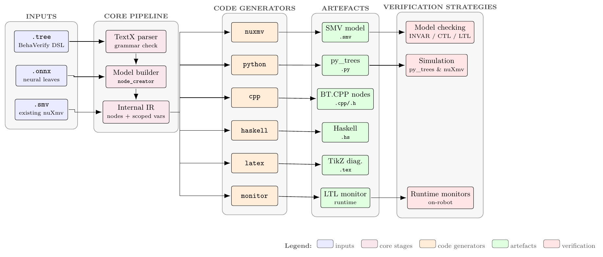

BehaVerify: Formal Verification for Behavior Trees
==================================================

.. rst-class:: lead

   **BehaVerify** is a Python toolbox that takes a behavior-tree
   specification and produces a formally verified model, an executable
   runtime, and a publication-quality diagram --- from a single
   ``.tree`` source file.

         flow through a TextX parser, model builder, and internal IR;
         the IR is lowered by six code generators (nuxmv, python, cpp,
         haskell, latex, monitor) into SMV, py_trees, BT.CPP, Haskell,
         TikZ, and runtime-monitor artefacts, which feed three
         verification strategies (model checking, simulation, runtime
         monitors).
   :class: pipeline-hero

.. note::

   BehaVerify is an active research tool first released at SEFM 2022
   and maintained at Vanderbilt's VeriVITAL lab. The landing diagram
   above is the same pipeline that underlies every peer-reviewed
   result; see :doc:`reference/publications`.

----

.. grid:: 2 2 3 3
   :gutter: 3

   .. grid-item-card:: Behavior-tree DSL
      :link: user-guide/tree-dsl
      :link-type: doc
      :class-card: sd-border-0 sd-shadow-sm
      :text-align: center

      A compact TextX grammar --- seven blocks, prefix-notation
      expressions, first-class temporal operators.

   .. grid-item-card:: Seven generation modes
      :link: user-guide/modes
      :link-type: doc
      :class-card: sd-border-0 sd-shadow-sm
      :text-align: center

      ``nuxmv``, ``python``, ``cpp``, ``haskell``, ``latex``,
      ``trace``, ``grid`` --- single DSL, many targets.

   .. grid-item-card:: Neural leaves (ONNX)
      :link: user-guide/neural-networks
      :link-type: doc
      :class-card: sd-border-0 sd-shadow-sm
      :text-align: center

      Drop ONNX classifiers or regressors straight into an ``action``;
      formally verify the composed neuro-symbolic tree.

   .. grid-item-card:: Scales past 2,000 nodes
      :link: user-guide/encodings
      :link-type: doc
      :class-card: sd-border-0 sd-shadow-sm
      :text-align: center

      Fast-forwarding SMV encoding + aggressive node trimming =
      verification at industrial tree sizes.

   .. grid-item-card:: Contingency monitors
      :link: user-guide/specifications
      :link-type: doc
      :class-card: sd-border-0 sd-shadow-sm
      :text-align: center

      Compile an LTL formula into a runtime monitor that can fire a
      BT action when violated.

   .. grid-item-card:: Reproducibility baked in
      :link: reference/publications
      :link-type: doc
      :class-card: sd-border-0 sd-shadow-sm
      :text-align: center

      Every paper ships its own ``REPRODUCIBILITY/<year>_<venue>/``
      directory with Docker, timing scripts, and expected results.

----

What flows through the pipeline
-------------------------------

The landing diagram above annotates every file type. In one sentence:

*Inputs* are a ``.tree`` behavior-tree description, optional ``.onnx``
neural-network weights, and (optionally) an already-compiled ``.smv``
model. The *core pipeline* parses the DSL, runs static validation, and
builds an internal IR of nodes, variables, and expressions. *Code
generators* lower that IR into six target languages. The resulting
*artefacts* then feed the *verification strategies*:

.. list-table::
   :header-rows: 1
   :widths: 32 68

   * - Strategy
     - What it answers
   * - Model checking (nuXmv on ``.smv``)
     - Is every reachable state safe? Does every path eventually reach
       the goal? Any LTL/CTL query in the ``specifications`` block.
   * - Simulation (``py_trees`` on ``.py``)
     - How does the tree behave under a specific input trace or random
       seed?
   * - Runtime monitors
     - On a deployed robot, has the specification just been violated?
       If yes, run the ``trigger_action``.

.. Reserved future row: uncomment to re-enable when the probabilistic
   backend lands.
..
   * - Probabilistic *(reserved)*
     - :math:`\Pr[F\,\mathrm{goal}] \ge 0.9`? Currently **planned** --- see
       :doc:`user-guide/verification-strategies`.

Getting started
---------------

.. grid:: 1 2 2 3
   :gutter: 3

   .. grid-item-card:: Installation
      :link: getting-started/installation
      :link-type: doc
      :class-card: sd-border-0 sd-shadow-sm

      ``pip install .`` plus nuXmv for the verification mode.

   .. grid-item-card:: Quickstart
      :link: getting-started/quickstart
      :link-type: doc
      :class-card: sd-border-0 sd-shadow-sm

      End-to-end DrunkenDrone in five minutes.

   .. grid-item-card:: Your first model
      :link: getting-started/first-model
      :link-type: doc
      :class-card: sd-border-0 sd-shadow-sm

      Author a minimal ``.tree`` file from scratch.

.. toctree::
   :maxdepth: 2
   :hidden:

   getting-started/index
   user-guide/index
   theory/index
   examples/index
   developer/index
   reference/index
